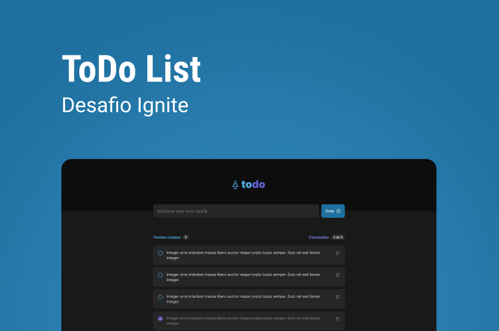

# Challange ToDo List 
 This project was developed during the React course of Rocketseat 🚀, on the Ignite project. It was an excellent opportunity to learn more about web develop with React.

## Getting started
To use this project, you must only is necessary to run the following code

```sh
npm i
```
and before install all dependencies, you must run

```sh
npm run dev
```
##

You can see the screens of this project in https://github.com/cintiasc/01-challange-todo-list/.github/assets.
## Useful links

- [Rocketseat](https://www.rocketseat.com.br/)
- [React project](https://reactjs.org/)